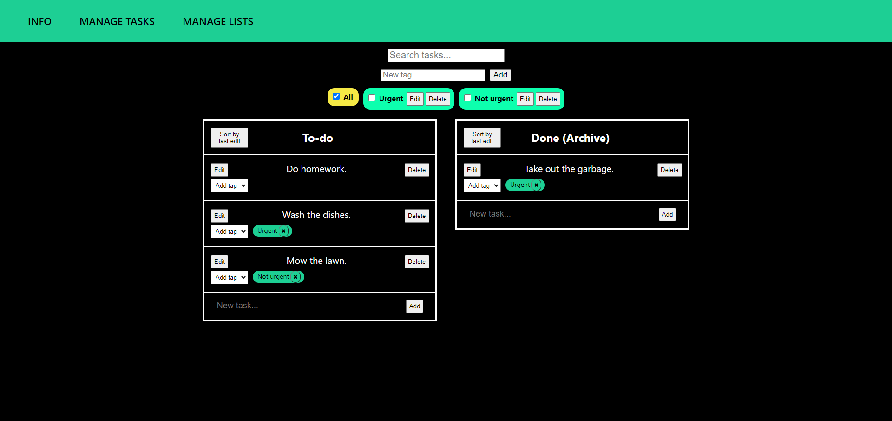

# Task Organizer
Task Organizer is a to-do application that allows users to organize lists of tasks. Lists can be created and deleted by the user and tasks can be added to those lists. The order of tasks and lists can be rearranged by dragging and dropping. The user can also edit the names of lists and descriptions of tasks. User created tags can also be added to tasks to filter them. A specific task can be searched for by it's description. The application is responsive and works with a minimum of 500px wide screen.

This is a frontend project created for school with React. The backend with a database for lists and tasks was created with the json-server module. Drag and drop was implemented using react-beautiful-dnd.

# Run with Node.js
Open a development build for the project with
```
npm start
```
Then open the database and backend with
```
npx json-server -H localhost -p 3010 -w ./db.json
```
# Screenshots


